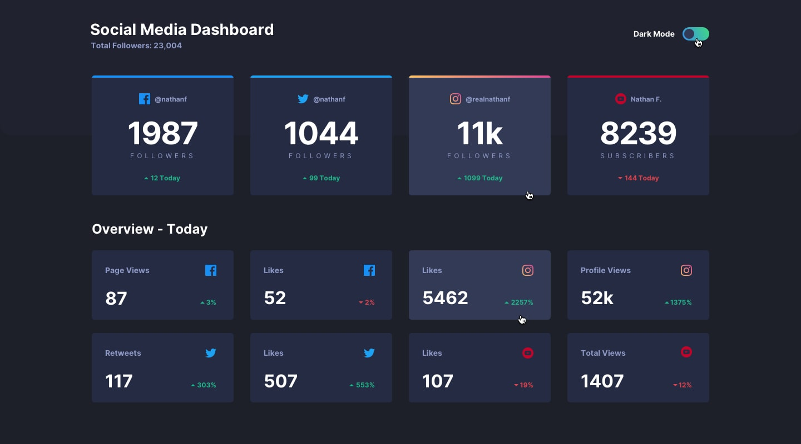

# Social Media Dashboard with Theme Switcher

This is a solution to the [Social media dashboard with theme switcher challenge on Frontend Mentor](https://www.frontendmentor.io/challenges/social-media-dashboard-with-theme-switcher-6oY8ozp_H). Frontend Mentor challenges help you improve your coding skills by building realistic projects.

## Table of contents

- [Overview](#overview)
  - [The challenge](#the-challenge)
  - [Screenshot](#screenshot)
  - [Links](#links)
- [My process](#my-process)
  - [Built with](#built-with)
  - [What I learned](#what-i-learned)
  - [Continued development](#continued-development)
  - [Useful resources](#useful-resources)
- [Author](#author)
- [Acknowledgments](#acknowledgments)

## Overview

### The challenge

Users should be able to:

- View the optimal layout for the site depending on their device's screen size
- See hover states for all interactive elements on the page
- Toggle color theme to their preference

### Screenshot

### Links

- Solution URL: [Github Repo](https://github.com/HugoSando/social_media_dashboard)
- Live Site URL: [Social_media_dashboard](https://hugosando.github.io/social_media_dashboard/)

## My process

### Built with

- HTML5
- CSS custom properties
- Flexbox
- CSS Grid
- Sass
- JavaScript

### What I learned

In this project, I learned how to implement a dark mode toggle functionality using JavaScript and manage themes using Sass variables. Additionally, I improved my skills in semantic HTML markup and responsive design.

### Continued development

In future projects, I plan to further explore JavaScript frameworks like React to enhance interactivity and efficiency in my applications. Additionally, I aim to deepen my understanding of CSS methodologies and design patterns for scalable and maintainable stylesheets.

### Useful resources

- [MDN Web Docs](https://developer.mozilla.org/en-US/docs/Web) - Comprehensive documentation for web technologies.
- [Sass Documentation](https://sass-lang.com/documentation) - Official Sass documentation for reference and learning.
- [Frontend Mentor](https://www.frontendmentor.io/) - Provides realistic challenges to practice and improve frontend skills.

## Author

- [HugoSando Github](https://github.com/HugoSando)
- Frontend Mentor - [HugoSando](https://www.frontendmentor.io/)

## Acknowledgments

I would like to thank Frontend Mentor for providing this challenge, as it helped me enhance my frontend development skills. Additionally, I'm grateful for the supportive online communities and resources that aided me throughout the project.

